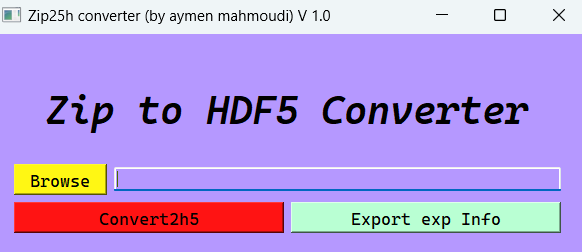

# Zip (SES) to HDF5 3D matrix converter

## Description
This project enables the conversion of zip files from the Scienta-Omicron SES program into HDF5 format, significantly enhancing compatibility with a wider range of software and IGOR macros. The zip format is processed using the navarp library developed by Federico Bisti (https://gitlab.com/fbisti/navarp), with a straightforward extraction process facilitated by an intuitive GUI included in the project.
 
The GUI enable also to save the experimeent relative infos into a txt file.

## Usage
The easiest way is to use the exe file from the bin folder (under W64). Otherwise, you can run the main file to launch the GUI (I recommend to setup a python 3.8 virtual environment).

## Roadmap
 <ul>
  <li>Integrate with the navarp GUI</li>
  <li>Create a PyPI package</li>
</ul> 

## Support and Contributing
Let me know if you have any suggestions/ideas to enhance those scripts or add further settings. I want you to know that your suggestions are warmly appreciated.
 
 
In case of a problem, it is strongly recommended that an issue be posted. For a more confidential demand, don't hesitate to email me.

